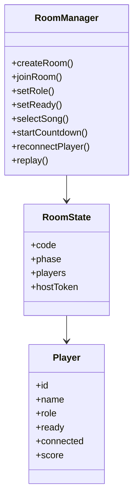

# Class — room / player (current)

```mermaid
classDiagram
  class RoomState {
    +code
    +phase
    +players
    +hostToken
  }
  class Player {
    +id
    +name
    +role
    +ready
    +connected
    +score
  }
  class RoomManager {
    +createRoom()
    +joinRoom()
    +setRole()
    +setReady()
    +selectSong()
    +startCountdown()
    +reconnectPlayer()
    +replay()
  }
  RoomManager --> RoomState
  RoomState --> Player
```

`apps/server/src/rooms/RoomManager.ts`, `packages/shared/src/types.ts`.
