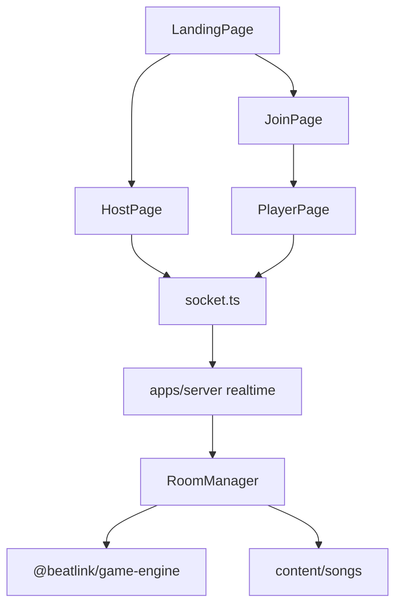

# Component — current

```mermaid
flowchart TB
  LAND[LandingPage]
  HOST[HostPage]
  JOIN[JoinPage]
  PLAY[PlayerPage]
  SOCK[socket.ts]
  SRV[apps/server realtime]
  RM[RoomManager]
  ENG["@beatlink/game-engine"]
  CAT[content/songs]
  LAND --> HOST
  LAND --> JOIN
  JOIN --> PLAY
  HOST --> SOCK
  PLAY --> SOCK
  SOCK --> SRV
  SRV --> RM
  RM --> ENG
  RM --> CAT
```
