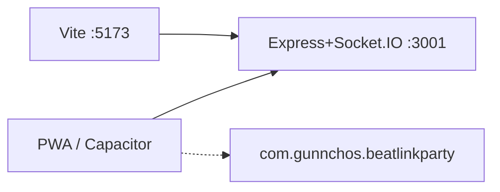

# Deployment — current

```mermaid
flowchart LR
  WEB[Vite :5173]
  API[Express+Socket.IO :3001]
  PWA[PWA / Capacitor]
  PKG[com.gunnchos.beatlinkparty]
  WEB --> API
  PWA --> API
  PWA -.-> PKG
```

`.env.example` documents `PORT`, `VITE_API_URL`, `VITE_WS_URL`. Pixel 6a blocked.
