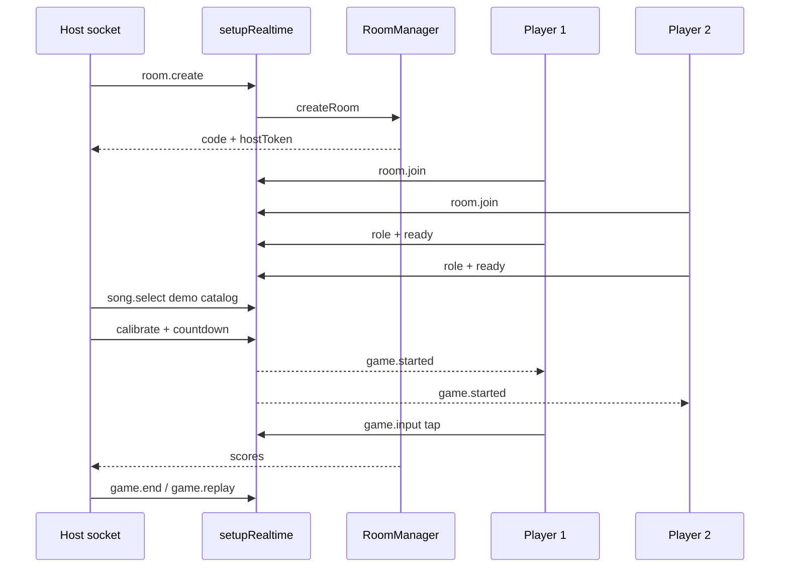

# Sequence — multiplayer round (current)

```mermaid
sequenceDiagram
  participant H as Host socket
  participant S as setupRealtime
  participant RM as RoomManager
  participant P1 as Player 1
  participant P2 as Player 2
  H->>S: room.create
  S->>RM: createRoom
  RM-->>H: code + hostToken
  P1->>S: room.join
  P2->>S: room.join
  P1->>S: role + ready
  P2->>S: role + ready
  H->>S: song.select demo catalog
  H->>S: calibrate + countdown
  S-->>P1: game.started
  S-->>P2: game.started
  P1->>S: game.input tap
  RM-->>H: scores
  H->>S: game.end / game.replay
```
