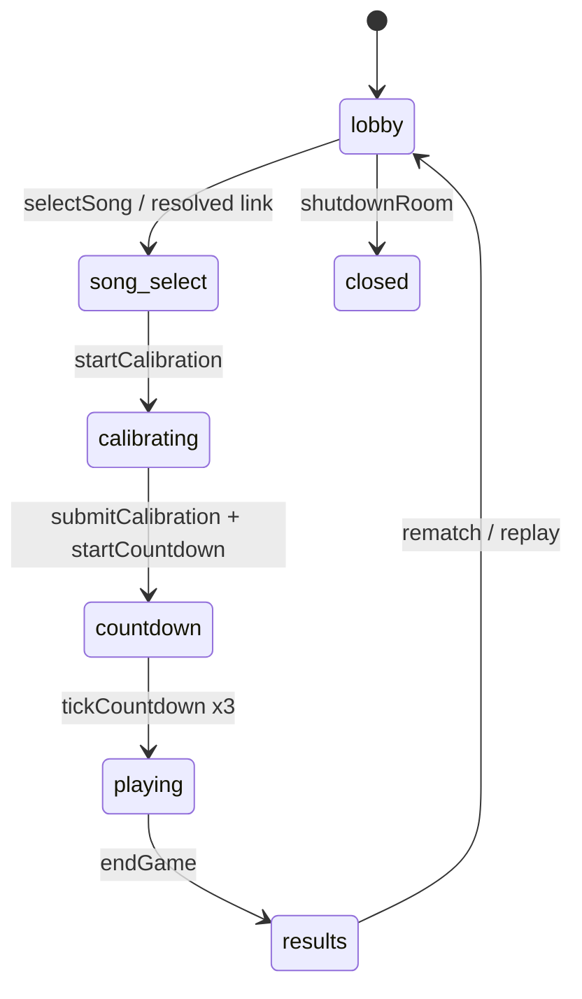

# State machine — room (current)

```mermaid
stateDiagram-v2
  [*] --> lobby
  lobby --> song_select: selectSong / resolved link
  song_select --> calibrating: startCalibration
  calibrating --> countdown: submitCalibration + startCountdown
  countdown --> playing: tickCountdown x3
  playing --> results: endGame
  results --> lobby: rematch / replay
  lobby --> closed: shutdownRoom
```

`RoomPhase` in `packages/shared/src/types.ts`. `paused` exists on the type; digital tests cover the happy path above.
