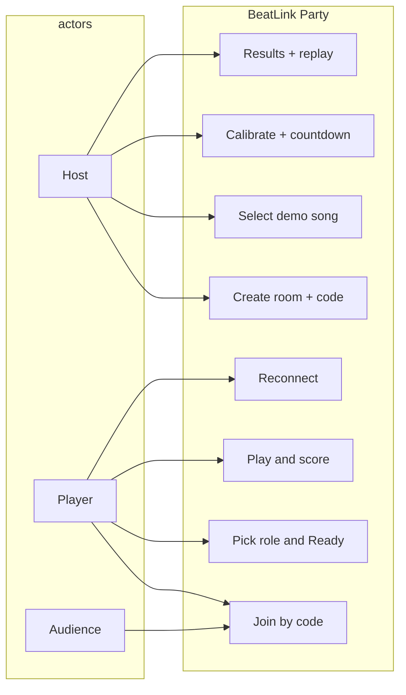

# Use case — current

```mermaid
flowchart LR
  subgraph actors
    H[Host]
    PL[Player]
    A[Audience]
  end
  subgraph party [BeatLink Party]
    UC1[Create room + code]
    UC2[Join by code]
    UC3[Pick role and Ready]
    UC4[Select demo song]
    UC5[Calibrate + countdown]
    UC6[Play and score]
    UC7[Results + replay]
    UC8[Reconnect]
  end
  H --> UC1
  PL --> UC2
  PL --> UC3
  H --> UC4
  H --> UC5
  PL --> UC6
  H --> UC7
  PL --> UC8
  A --> UC2
```
