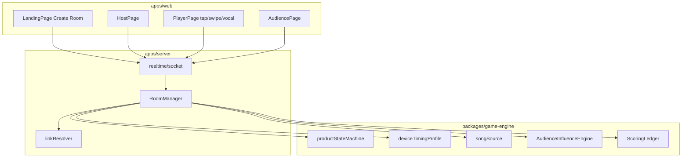

# Wave007 Component View

```mermaid
flowchart TB
  subgraph web [apps/web]
    Landing[LandingPage Create Room]
    Host[HostPage]
    Player[PlayerPage tap/swipe/vocal]
    Audience[AudiencePage]
  end
  subgraph server [apps/server]
    Socket[realtime/socket]
    RM[RoomManager]
    Link[linkResolver]
  end
  subgraph engine [packages/game-engine]
    SM[productStateMachine]
    DTP[deviceTimingProfile]
    SS[songSource]
    AIE[AudienceInfluenceEngine]
    SL[ScoringLedger]
  end
  Landing --> Socket
  Host --> Socket
  Player --> Socket
  Audience --> Socket
  Socket --> RM
  RM --> SM
  RM --> DTP
  RM --> SS
  RM --> AIE
  RM --> SL
  RM --> Link
```

Authoritative: membership, roles, rounds, song-source, timing, scores, audience, reconnect, rematch.
