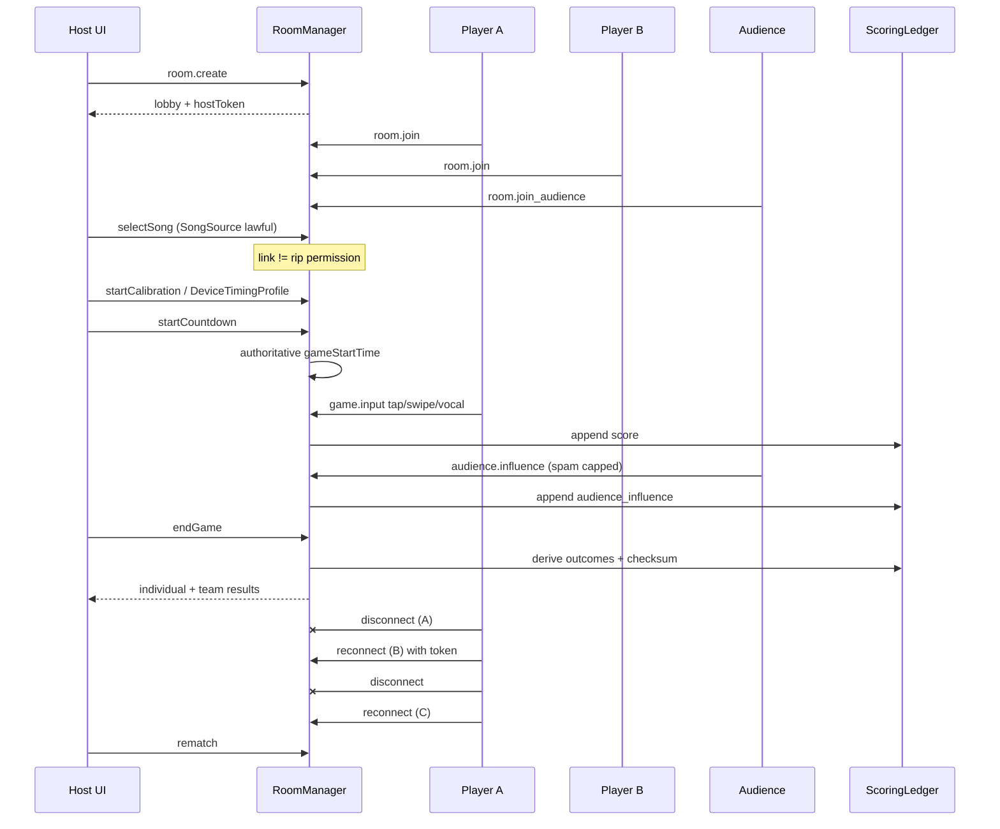

# Wave007 Party Loop Sequence

```mermaid
sequenceDiagram
  participant Host as Host UI
  participant Server as RoomManager
  participant P1 as Player A
  participant P2 as Player B
  participant Aud as Audience
  participant Ledger as ScoringLedger

  Host->>Server: room.create
  Server-->>Host: lobby + hostToken
  P1->>Server: room.join
  P2->>Server: room.join
  Aud->>Server: room.join_audience
  Host->>Server: selectSong (SongSource lawful)
  Note over Server: link != rip permission
  Host->>Server: startCalibration / DeviceTimingProfile
  Host->>Server: startCountdown
  Server->>Server: authoritative gameStartTime
  P1->>Server: game.input tap/swipe/vocal
  Server->>Ledger: append score
  Aud->>Server: audience.influence (spam capped)
  Server->>Ledger: append audience_influence
  Host->>Server: endGame
  Server->>Ledger: derive outcomes + checksum
  Server-->>Host: individual + team results
  P1-xServer: disconnect (A)
  P1->>Server: reconnect (B) with token
  P1-xServer: disconnect
  P1->>Server: reconnect (C)
  Host->>Server: rematch
```
