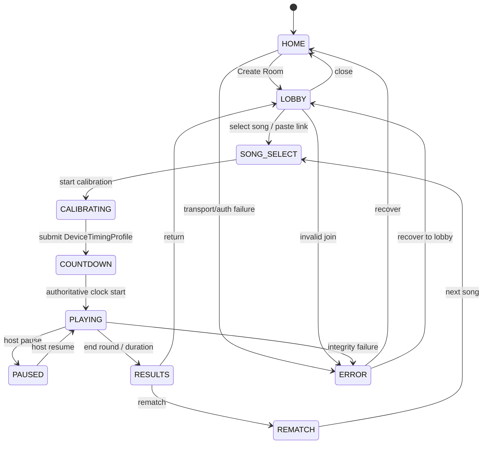

# Wave007 Product State Machine (HOME..ERROR)

RoomPhase mapping: lobby↔LOBBY/REMATCH, song_select↔SONG_SELECT, calibrating↔CALIBRATING,
countdown↔COUNTDOWN, playing↔PLAYING, paused↔PAUSED, results↔RESULTS, closed↔HOME.
